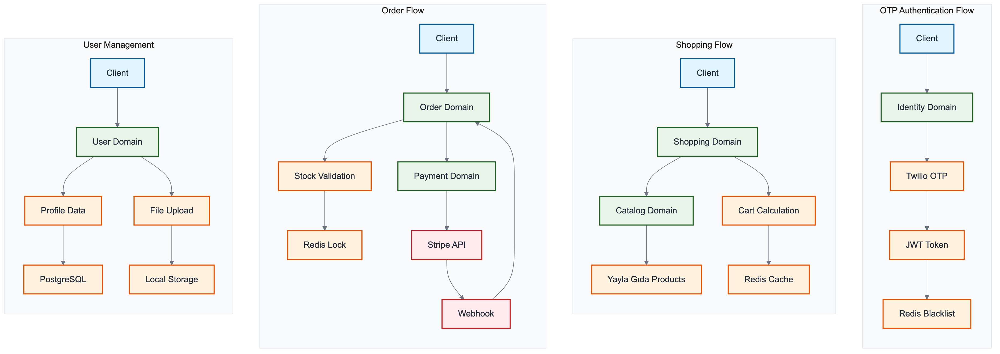
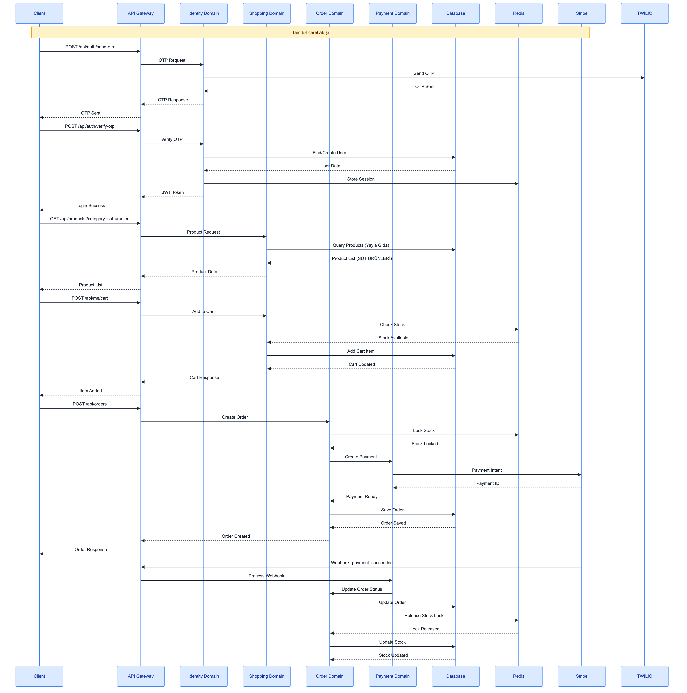
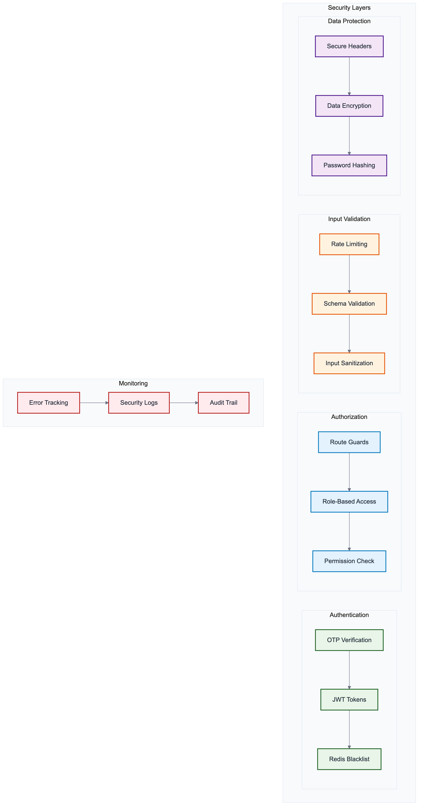
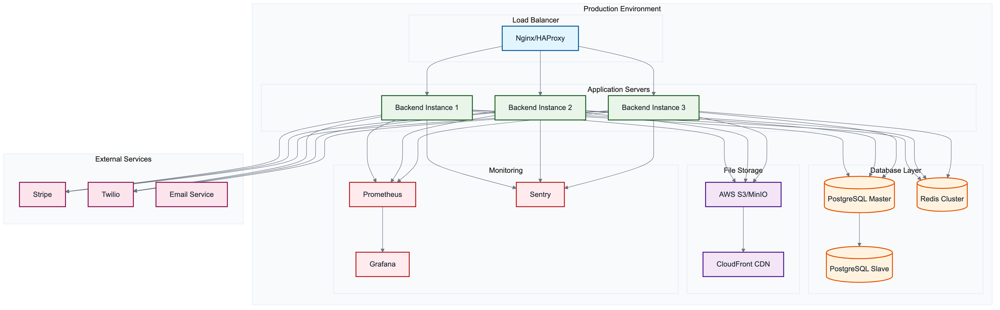
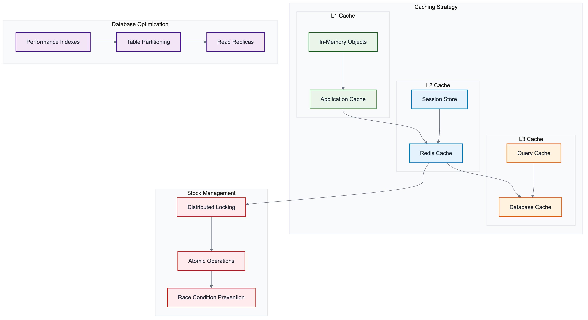

# Metropolitan Backend Dokümantasyonu

Bu dokümantasyon, Metropolitan e-ticaret platformunun backend servisinin detaylı teknik açıklamasını içerir.

## 📋 İçindekiler

1. [Mimari Genel Bakış](./architecture.md) - Sistem mimarisi ve tasarım prensipleri
2. [Domain Yapısı](./domains.md) - Domain-Driven Design yaklaşımı ve domain'ler
3. [Veritabanı Mimarisi](./database.md) - PostgreSQL şeması ve Redis cache yapısı
4. [API Dokümantasyonu](./api.md) - REST API endpoint'leri ve kullanımı
5. [Mimari Diyagramları](./architecture-diagram.md) - Sistem mimarisi görsel diyagramları

## 🎨 Mimari Diyagramları

### Sistem Mimarisi


### Domain Etkileşimi


### Veri Akışı


### Güvenlik Mimarisi


### Deployment Mimarisi


### Performance Mimarisi


## 🚀 Hızlı Başlangıç

```bash
# Bağımlılıkları yükle
bun install

# Veritabanı migration'larını çalıştır
bun run db:migrate

# Development server'ı başlat (sadece test için)
bun run dev

# Testleri çalıştır
bun test

# Production build
bun run build
```

## 🏗️ Teknoloji Stack'i

- **Runtime**: Bun (JavaScript/TypeScript)
- **Framework**: Elysia (TypeScript web framework)
- **Veritabanı**: PostgreSQL + Drizzle ORM
- **Cache**: Redis + IORedis
- **Authentication**: JWT + Redis blacklisting
- **Payments**: Stripe
- **Monitoring**: Sentry + Pino
- **Testing**: Bun Test Runner

## 📊 Proje Durumu

- **Production Ready**: ✅ Evet
- **Test Coverage**: 39 kapsamlı test
- **Performance**: Redis-based stock management
- **Security**: Multi-layered validation
- **Monitoring**: Sentry + Pino entegrasyonu

## 🔗 Diğer Bileşenler

- [Mobile App](../mobile-app/README.md) - React Native mobil uygulaması
- [Shared Package](../shared/README.md) - Ortak tipler ve utilities