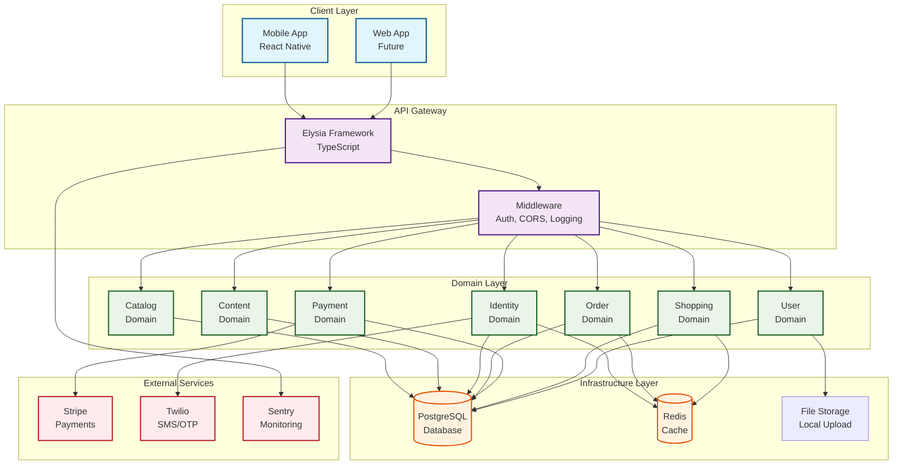
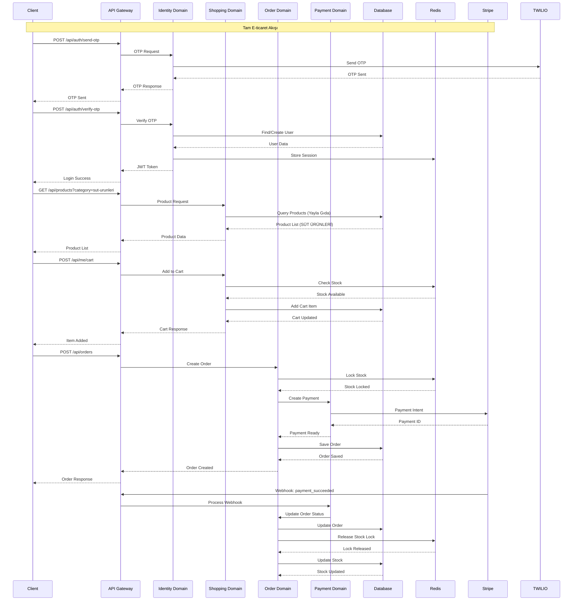
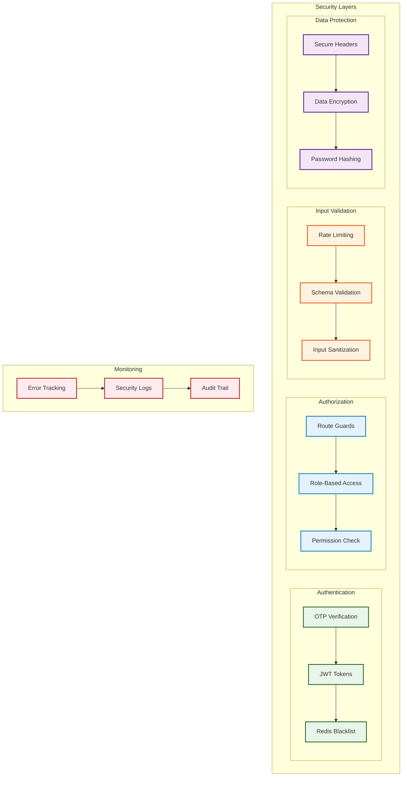
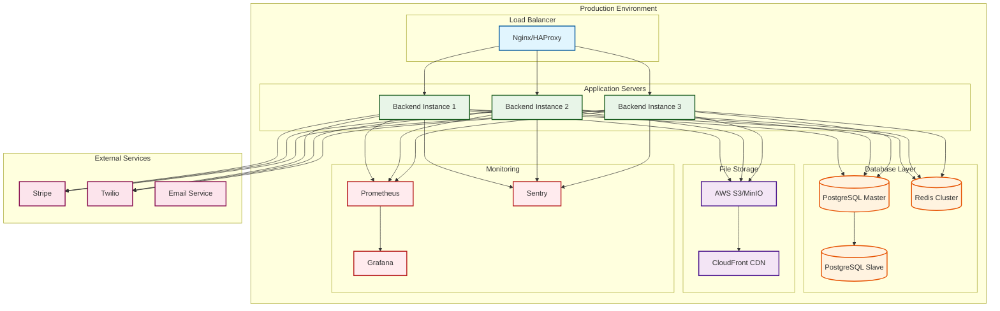
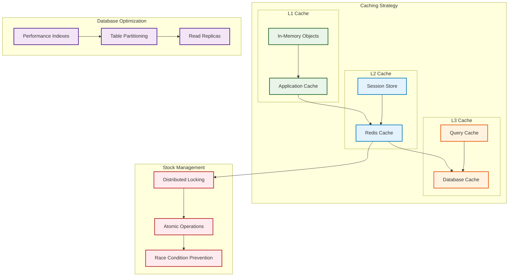

# Mimari Diyagramları

## 🏗️ Sistem Mimarisi

```mermaid
graph TB
    subgraph "Client Layer"
        MA[Mobile App<br/>React Native]
        WA[Web App<br/>Future]
    end
    
    subgraph "API Gateway"
        ELY[Elysia Framework<br/>TypeScript]
        MW[Middleware<br/>Auth, CORS, Logging]
    end
    
    subgraph "Domain Layer"
        CAT[Catalog<br/>Domain]
        CONT[Content<br/>Domain]
        ID[Identity<br/>Domain]
        ORD[Order<br/>Domain]
        PAY[Payment<br/>Domain]
        SHOP[Shopping<br/>Domain]
        USER[User<br/>Domain]
    end
    
    subgraph "Infrastructure Layer"
        DB[(PostgreSQL<br/>Database)]
        REDIS[(Redis<br/>Cache)]
        STORAGE[File Storage<br/>Local Upload]
    end
    
    subgraph "External Services"
        STRIPE[Stripe<br/>Payments]
        TWILIO[Twilio<br/>SMS/OTP]
        SENTRY[Sentry<br/>Monitoring]
    end
    
    MA --> ELY
    WA --> ELY
    ELY --> MW
    MW --> CAT
    MW --> CONT
    MW --> ID
    MW --> ORD
    MW --> PAY
    MW --> SHOP
    MW --> USER
    
    CAT --> DB
    CONT --> DB
    ID --> DB
    ID --> REDIS
    ORD --> DB
    ORD --> REDIS
    PAY --> DB
    SHOP --> DB
    SHOP --> REDIS
    USER --> DB
    USER --> STORAGE
    
    PAY --> STRIPE
    ID --> TWILIO
    ELY --> SENTRY
    
    classDef client fill:#e1f5fe,stroke:#01579b,stroke-width:2px
    classDef api fill:#f3e5f5,stroke:#4a148c,stroke-width:2px
    classDef domain fill:#e8f5e8,stroke:#1b5e20,stroke-width:2px
    classDef infra fill:#fff3e0,stroke:#e65100,stroke-width:2px
    classDef external fill:#ffebee,stroke:#b71c1c,stroke-width:2px
    
    class MA,WA client
    class ELY,MW api
    class CAT,CONT,ID,ORD,PAY,SHOP,USER domain
    class DB,REDIS,S3 infra
    class STRIPE,TWILIO,SENTRY external
```

## 🔄 Domain Etkileşim Diyagramı

```mermaid
graph TD
    subgraph "OTP Authentication Flow"
        A[Client] --> B[Identity Domain]
        B --> C[Twilio OTP]
        C --> D[JWT Token]
        D --> E[Redis Blacklist]
    end
    
    subgraph "Shopping Flow"
        F[Client] --> G[Shopping Domain]
        G --> H[Catalog Domain]
        H --> I[Yayla Gıda Products]
        G --> J[Cart Calculation]
        J --> K[Redis Cache]
    end
    
    subgraph "Order Flow"
        L[Client] --> M[Order Domain]
        M --> N[Stock Validation]
        N --> O[Redis Lock]
        M --> P[Payment Domain]
        P --> Q[Stripe API]
        Q --> R[Webhook]
        R --> M
    end
    
    subgraph "User Management"
        S[Client] --> T[User Domain]
        T --> U[Profile Data]
        U --> V[PostgreSQL]
        T --> W[File Upload]
        W --> X[Local Storage]
    end
    
    classDef client fill:#e1f5fe,stroke:#01579b,stroke-width:2px
    classDef domain fill:#e8f5e8,stroke:#1b5e20,stroke-width:2px
    classDef storage fill:#fff3e0,stroke:#e65100,stroke-width:2px
    classDef external fill:#ffebee,stroke:#b71c1c,stroke-width:2px
    
    class A,F,L,S client
    class B,G,H,M,P,T domain
    class C,D,E,I,J,K,N,O,U,V,W,X storage
    class Q,R external
```

## 📊 Veri Akış Diyagramı

```mermaid
sequenceDiagram
    participant C as Client
    participant A as API Gateway
    participant AUTH as Identity Domain
    participant SHOP as Shopping Domain
    participant ORD as Order Domain
    participant PAY as Payment Domain
    participant DB as Database
    participant REDIS as Redis
    participant STRIPE as Stripe
    
    Note over C,STRIPE: Tam E-ticaret Akışı
    
    C->>A: POST /api/auth/send-otp
    A->>AUTH: OTP Request
    AUTH->>TWILIO: Send OTP
    TWILIO-->>AUTH: OTP Sent
    AUTH-->>A: OTP Response
    A-->>C: OTP Sent
    
    C->>A: POST /api/auth/verify-otp
    A->>AUTH: Verify OTP
    AUTH->>DB: Find/Create User
    DB-->>AUTH: User Data
    AUTH->>REDIS: Store Session
    AUTH-->>A: JWT Token
    A-->>C: Login Success
    
    C->>A: GET /api/products?category=sut-urunleri
    A->>SHOP: Product Request
    SHOP->>DB: Query Products (Yayla Gıda)
    DB-->>SHOP: Product List (SÜT ÜRÜNLERİ)
    SHOP-->>A: Product Data
    A-->>C: Product List
    
    C->>A: POST /api/me/cart
    A->>SHOP: Add to Cart
    SHOP->>REDIS: Check Stock
    REDIS-->>SHOP: Stock Available
    SHOP->>DB: Add Cart Item
    DB-->>SHOP: Cart Updated
    SHOP-->>A: Cart Response
    A-->>C: Item Added
    
    C->>A: POST /api/orders
    A->>ORD: Create Order
    ORD->>REDIS: Lock Stock
    REDIS-->>ORD: Stock Locked
    ORD->>PAY: Create Payment
    PAY->>STRIPE: Payment Intent
    STRIPE-->>PAY: Payment ID
    PAY-->>ORD: Payment Ready
    ORD->>DB: Save Order
    DB-->>ORD: Order Saved
    ORD-->>A: Order Created
    A-->>C: Order Response
    
    STRIPE->>A: Webhook: payment_succeeded
    A->>PAY: Process Webhook
    PAY->>ORD: Update Order Status
    ORD->>DB: Update Order
    ORD->>REDIS: Release Stock Lock
    REDIS-->>ORD: Lock Released
    ORD->>DB: Update Stock
    DB-->>ORD: Stock Updated
```

## 🔒 Güvenlik Mimarisi

```mermaid
graph TB
    subgraph "Security Layers"
        subgraph "Authentication"
            JWT[JWT Tokens]
            BLACKLIST[Redis Blacklist]
            OTP[OTP Verification]
        end
        
        subgraph "Authorization"
            RBAC[Role-Based Access]
            GUARD[Route Guards]
            PERMISSION[Permission Check]
        end
        
        subgraph "Input Validation"
            SCHEMA[Schema Validation]
            SANITIZE[Input Sanitization]
            RATE[Rate Limiting]
        end
        
        subgraph "Data Protection"
            ENCRYPT[Data Encryption]
            HASH[Password Hashing]
            SECURE[Secure Headers]
        end
    end
    
    subgraph "Monitoring"
        SENTRY[Error Tracking]
        LOGS[Security Logs]
        AUDIT[Audit Trail]
    end
    
    JWT --> BLACKLIST
    OTP --> JWT
    RBAC --> PERMISSION
    GUARD --> RBAC
    SCHEMA --> SANITIZE
    RATE --> SCHEMA
    ENCRYPT --> HASH
    SECURE --> ENCRYPT
    
    SENTRY --> LOGS
    LOGS --> AUDIT
    
    classDef auth fill:#e8f5e8,stroke:#1b5e20,stroke-width:2px
    classDef authz fill:#e3f2fd,stroke:#0277bd,stroke-width:2px
    classDef input fill:#fff3e0,stroke:#e65100,stroke-width:2px
    classDef data fill:#f3e5f5,stroke:#4a148c,stroke-width:2px
    classDef monitor fill:#ffebee,stroke:#b71c1c,stroke-width:2px
    
    class JWT,BLACKLIST,OTP auth
    class RBAC,GUARD,PERMISSION authz
    class SCHEMA,SANITIZE,RATE input
    class ENCRYPT,HASH,SECURE data
    class SENTRY,LOGS,AUDIT monitor
```

## 🚀 Deployment Mimarisi

```mermaid
graph TB
    subgraph "Production Environment"
        subgraph "Load Balancer"
            LB[Nginx/HAProxy]
        end
        
        subgraph "Application Servers"
            APP1[Backend Instance 1]
            APP2[Backend Instance 2]
            APP3[Backend Instance 3]
        end
        
        subgraph "Database Layer"
            MASTER[(PostgreSQL Master)]
            SLAVE[(PostgreSQL Slave)]
            REDIS_CLUSTER[(Redis Cluster)]
        end
        
        subgraph "File Storage"
            S3[AWS S3/MinIO]
            CDN[CloudFront CDN]
        end
        
        subgraph "Monitoring"
            PROMETHEUS[Prometheus]
            GRAFANA[Grafana]
            SENTRY_PROD[Sentry]
        end
    end
    
    subgraph "External Services"
        STRIPE_PROD[Stripe]
        TWILIO_PROD[Twilio]
        SMTP[Email Service]
    end
    
    LB --> APP1
    LB --> APP2
    LB --> APP3
    
    APP1 --> MASTER
    APP2 --> MASTER
    APP3 --> MASTER
    
    MASTER --> SLAVE
    
    APP1 --> REDIS_CLUSTER
    APP2 --> REDIS_CLUSTER
    APP3 --> REDIS_CLUSTER
    
    APP1 --> S3
    APP2 --> S3
    APP3 --> S3
    
    S3 --> CDN
    
    APP1 --> PROMETHEUS
    APP2 --> PROMETHEUS
    APP3 --> PROMETHEUS
    
    PROMETHEUS --> GRAFANA
    
    APP1 --> SENTRY_PROD
    APP2 --> SENTRY_PROD
    APP3 --> SENTRY_PROD
    
    APP1 --> STRIPE_PROD
    APP2 --> STRIPE_PROD
    APP3 --> STRIPE_PROD
    
    APP1 --> TWILIO_PROD
    APP2 --> TWILIO_PROD
    APP3 --> TWILIO_PROD
    
    classDef lb fill:#e1f5fe,stroke:#01579b,stroke-width:2px
    classDef app fill:#e8f5e8,stroke:#1b5e20,stroke-width:2px
    classDef db fill:#fff3e0,stroke:#e65100,stroke-width:2px
    classDef storage fill:#f3e5f5,stroke:#4a148c,stroke-width:2px
    classDef monitor fill:#ffebee,stroke:#b71c1c,stroke-width:2px
    classDef external fill:#fce4ec,stroke:#880e4f,stroke-width:2px
    
    class LB lb
    class APP1,APP2,APP3 app
    class MASTER,SLAVE,REDIS_CLUSTER db
    class S3,CDN storage
    class PROMETHEUS,GRAFANA,SENTRY_PROD monitor
    class STRIPE_PROD,TWILIO_PROD,SMTP external
```

## 📈 Performance Mimarisi

```mermaid
graph TB
    subgraph "Caching Strategy"
        subgraph "L1 Cache"
            APP_CACHE[Application Cache]
            MEMORY[In-Memory Objects]
        end
        
        subgraph "L2 Cache"
            REDIS_CACHE[Redis Cache]
            SESSION[Session Store]
        end
        
        subgraph "L3 Cache"
            DB_CACHE[Database Cache]
            QUERY_CACHE[Query Cache]
        end
    end
    
    subgraph "Database Optimization"
        INDEXES[Performance Indexes]
        PARTITIONING[Table Partitioning]
        REPLICATION[Read Replicas]
    end
    
    subgraph "Stock Management"
        DISTRIBUTED_LOCK[Distributed Locking]
        ATOMIC_OPS[Atomic Operations]
        RACE_PREVENTION[Race Condition Prevention]
    end
    
    APP_CACHE --> REDIS_CACHE
    REDIS_CACHE --> DB_CACHE
    
    MEMORY --> APP_CACHE
    SESSION --> REDIS_CACHE
    QUERY_CACHE --> DB_CACHE
    
    INDEXES --> PARTITIONING
    PARTITIONING --> REPLICATION
    
    DISTRIBUTED_LOCK --> ATOMIC_OPS
    ATOMIC_OPS --> RACE_PREVENTION
    
    REDIS_CACHE --> DISTRIBUTED_LOCK
    
    classDef l1 fill:#e8f5e8,stroke:#1b5e20,stroke-width:2px
    classDef l2 fill:#e3f2fd,stroke:#0277bd,stroke-width:2px
    classDef l3 fill:#fff3e0,stroke:#e65100,stroke-width:2px
    classDef db fill:#f3e5f5,stroke:#4a148c,stroke-width:2px
    classDef stock fill:#ffebee,stroke:#b71c1c,stroke-width:2px
    
    class APP_CACHE,MEMORY l1
    class REDIS_CACHE,SESSION l2
    class DB_CACHE,QUERY_CACHE l3
    class INDEXES,PARTITIONING,REPLICATION db
    class DISTRIBUTED_LOCK,ATOMIC_OPS,RACE_PREVENTION stock
```