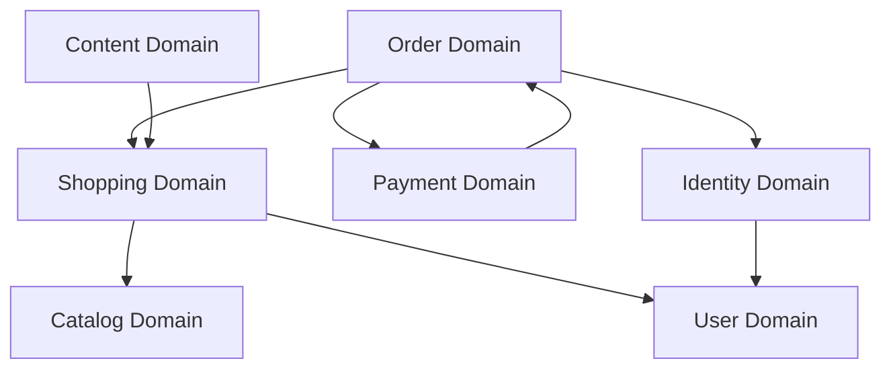

# Domain Yapısı ve İş Mantığı

## 🏗️ Domain-Driven Design (DDD) Yaklaşımı

Metropolitan Backend, **Domain-Driven Design** prensiplerini takip ederek, iş mantığını domain'lere ayırarak organize edilmiştir. Her domain kendi sorumluluğunu üstlenir ve diğer domain'lerle gevşek bağlılık (loose coupling) ile etkileşim kurar.

## 📦 Domain Listesi

### 1. Catalog Domain 🏪

**Konum**: `src/domains/catalog/`

**Sorumluluk**: Ürün katalogu yönetimi, ürün listesi, kategoriler ve arama işlemleri

**Ana Bileşenler**:
- `products.routes.ts` - Ürün API endpoints

**Endpoint'ler**:
- `GET /api/products` - Ürün listesi (dil ve kategori filtreleme)
- `GET /api/products/categories` - Kategori listesi

**Temel Özellikler**:
- Çok dilli ürün desteği (TR/EN/PL)
- Kategori tabanlı filtreleme (7 gerçek kategori: SÜT ÜRÜNLERİ, BAKLİYAT, ET ÜRÜNLERİ, SALÇA VE EZMELER, UNLU MAMÜLLER, ZEYTİNLER, DİĞER ÜRÜNLER)
- Stok durumu kontrolü
- Ürün görselleri yönetimi
- Yayla marka gıda ürünleri

---

### 2. Content Domain 📄

**Konum**: `src/domains/content/`

**Sorumluluk**: İçerik yönetimi, misafir işlemleri, FAQ ve şartlar

**Ana Bileşenler**:
- `content.routes.ts` - İçerik API endpoints
- `guest.routes.ts` - Misafir işlemleri
- `faq.content.ts` - FAQ değer nesnesi
- `terms.content.ts` - Şartlar ve koşullar

**Endpoint'ler**:
- `GET /api/content/faq` - Sık sorulan sorular
- `GET /api/content/terms` - Kullanım şartları
- `POST /api/guest/session/create` - Misafir session oluşturma
- `GET /api/guest/cart/:guestId` - Misafir sepeti
- `POST /api/guest/cart/add` - Misafir sepetine ürün ekleme
- `DELETE /api/guest/cart/:guestId/:itemId` - Misafir sepetinden ürün çıkarma
- `GET /api/guest/favorites/:guestId` - Misafir favorileri
- `POST /api/guest/favorites/add` - Misafir favorilere ürün ekleme
- `DELETE /api/guest/favorites/:guestId/:productId` - Misafir favorilerden ürün çıkarma

**Temel Özellikler**:
- Çok dilli içerik desteği
- Misafir sepeti yönetimi
- İçerik versiyonlama
- Static content caching

---

### 3. Identity Domain 🔐

**Konum**: `src/domains/identity/`

**Sorumluluk**: Kimlik doğrulama, yetkilendirme, OTP işlemleri

**Ana Bileşenler**:
- `auth.routes.ts` - Authentication endpoints
- `otp.service.ts` - OTP servis mantığı

**Endpoint'ler**:
- `POST /api/auth/send-otp` - OTP gönderme
- `POST /api/auth/verify-otp` - OTP doğrulama
- `POST /api/auth/migrate-guest-data` - Misafir verilerini kullanıcı hesabına taşıma
- `POST /api/auth/logout` - Çıkış işlemi (Token blacklisting)

**Temel Özellikler**:
- JWT token yönetimi
- Redis-based token blacklisting
- Twilio OTP integration
- Environment-based OTP bypass (development)
- Rate limiting on auth endpoints
- Secure password hashing

**Güvenlik Özellikleri**:
- Brute force protection
- Token rotation
- Secure logout (token invalidation)
- Multi-factor authentication (OTP)

---

### 4. Order Domain 📦

**Konum**: `src/domains/order/`

**Sorumluluk**: Sipariş yaşam döngüsü, fatura işlemleri, sipariş takibi

**Ana Bileşenler**:
- `orders.routes.ts` - Sipariş API endpoints
- `invoices.routes.ts` - Fatura API endpoints
- `order-creation.service.ts` - Sipariş oluşturma mantığı
- `order-calculation.service.ts` - Fiyat hesaplama
- `order-validation.service.ts` - Sipariş doğrulama
- `invoice.service.ts` - Fatura oluşturma
- `pdf.service.ts` - PDF fatura servisi

**Endpoint'ler**:
- `POST /api/orders` - Sipariş oluşturma
- `GET /api/orders` - Kullanıcı siparişleri
- `GET /api/orders/:orderId` - Sipariş detayı
- `GET /api/orders/tracking/:trackingNumber` - Kargo takip numarası ile sipariş sorgulama
- `DELETE /api/orders/:orderId` - Sipariş iptali
- `GET /api/invoices/:orderId` - Fatura indirme (PDF)

**Temel Özellikler**:
- **Atomic Stock Management**: Redis distributed locking
- **Race Condition Prevention**: Concurrent order protection
- **Invoice Generation**: PDF fatura oluşturma
- **Order Tracking**: Real-time sipariş takibi
- **Multi-currency Support**: PLN, EUR, USD
- **Tax Calculation**: KDV hesaplama
- **Shipping Integration**: Kargo takip entegrasyonu

**Kritik İş Mantığı**:
```typescript
// Sipariş oluşturma süreci
1. Sepet doğrulama
2. Stock rezervasyonu (Redis lock)
3. Fiyat hesaplama
4. Payment intent oluşturma
5. Database transaction
6. Stock güncelleme
7. Fatura oluşturma
```

---

### 5. Payment Domain 💳

**Konum**: `src/domains/payment/`

**Sorumluluk**: Ödeme işlemleri, Stripe integration, webhook handling

**Ana Bileşenler**:
- `payment.routes.ts` - Ödeme API endpoints
- `stripe-webhook.routes.ts` - Stripe webhook handling

**Endpoint'ler**:
- `GET /api/users/me/payment-methods` - Kullanıcının ödeme yöntemleri
- `POST /api/users/me/payment-methods` - Yeni ödeme yöntemi ekleme
- `DELETE /api/users/me/payment-methods/:paymentMethodId` - Ödeme yöntemi silme
- `POST /stripe/webhook` - Stripe webhook endpoint (root seviyesinde)

**Temel Özellikler**:
- **Stripe Integration**: Secure payment processing
- **Webhook Idempotency**: Duplicate event prevention
- **3D Secure Support**: Enhanced security
- **Refund Management**: Iade işlemleri
- **Multi-payment Methods**: Kart, SEPA, iDEAL
- **Currency Conversion**: Real-time exchange rates

**Webhook Events**:
- `payment_intent.succeeded`
- `payment_intent.payment_failed`
- `payment_intent.canceled`
- `invoice.payment_succeeded`
- `customer.subscription.created`

---

### 6. Shopping Domain 🛒

**Konum**: `src/domains/shopping/`

**Sorumluluk**: Sepet yönetimi, favoriler, alışveriş deneyimi

**Ana Bileşenler**:
- `cart.routes.ts` - Sepet API endpoints
- `favorites.routes.ts` - Favoriler API endpoints
- `cart-calculation.service.ts` - Sepet hesaplama
- `cart-item.service.ts` - Sepet öğesi yönetimi
- `cart-validation.service.ts` - Sepet doğrulama

**Endpoint'ler**:
- `GET /api/me/cart` - Kullanıcı sepeti
- `POST /api/me/cart` - Sepete ürün ekleme
- `PUT /api/me/cart/:itemId` - Sepet öğesi güncelleme
- `DELETE /api/me/cart/:itemId` - Sepetten ürün çıkarma
- `DELETE /api/me/cart` - Sepeti temizleme
- `GET /api/users/me/favorites` - Kullanıcı favorileri
- `POST /api/users/me/favorites` - Favorilere ekleme
- `DELETE /api/users/me/favorites/:productId` - Favorilerden çıkarma

**Temel Özellikler**:
- **Real-time Cart Updates**: Anlık sepet güncelleme
- **Stock Validation**: Stok kontrolü
- **Price Calculation**: Dinamik fiyat hesaplama
- **Discount Application**: İndirim uygulama
- **Cart Persistence**: Sepet kalıcılığı
- **Guest Cart Migration**: Misafir sepeti taşıma
- **Bulk Operations**: Toplu işlemler

**Sepet Hesaplama Algoritması**:
```typescript
// Sepet toplam hesaplama
1. Ürün fiyatları × miktarlar
2. İndirim uygulaması
3. KDV hesaplama
4. Kargo ücreti
5. Toplam tutar
```

---

### 7. User Domain 👤

**Konum**: `src/domains/user/`

**Sorumluluk**: Kullanıcı profili, adres yönetimi, profil fotoğrafı

**Ana Bileşenler**:
- `profile.routes.ts` - Profil API endpoints
- `address.routes.ts` - Adres API endpoints
- `profile-completion.service.ts` - Profil tamamlama
- `profile-photo.service.ts` - Profil fotoğrafı yönetimi
- `profile-update.service.ts` - Profil güncelleme

**Endpoint'ler**:
- `POST /api/complete-profile` - Profil tamamlama (registration token gerekli)
- `GET /api/users/me` - Kullanıcı profili
- `PUT /api/users/me` - Profil güncelleme
- `POST /api/users/me/profile-photo` - Profil fotoğrafı yükleme
- `GET /api/users/me/addresses` - Kullanıcı adresleri
- `POST /api/users/me/addresses` - Yeni adres ekleme
- `PUT /api/users/me/addresses/:addressId` - Adres güncelleme
- `DELETE /api/users/me/addresses/:addressId` - Adres silme
- `POST /api/users/me/addresses/:addressId/set-default` - Varsayılan adres ayarlama

**Temel Özellikler**:
- **Profile Management**: Kişisel bilgi yönetimi
- **Address Book**: Çoklu adres desteği
- **Photo Upload**: Secure file upload (2MB limit)
- **Data Validation**: Comprehensive input validation
- **Privacy Controls**: Data protection compliance
- **Profile Completion**: Guided profile setup

**Güvenlik Özellikleri**:
- **File Upload Security**: MIME type validation
- **Magic Number Detection**: File type verification
- **Size Limitations**: 2MB max file size
- **Secure Storage**: Encrypted file storage
- **Access Control**: User-specific data access

---

### 8. Shared/Utils Domain 🔧

**Konum**: `src/shared/application/common/`

**Sorumluluk**: Ortak servisler, yardımcı araçlar, sistem kontrolü

**Ana Bileşenler**:
- `utils.routes.ts` - Yardımcı API endpoints
- `health.routes.ts` - Sistem sağlık kontrolü

**Endpoint'ler**:
- `POST /api/utils/check-nip` - NIP (Polonya vergi numarası) doğrulama
- `GET /health` - Basit sağlık kontrolü
- `GET /health/detailed` - Detaylı sağlık kontrolü
- `GET /health/ready` - Hazır olma durumu (Kubernetes)
- `GET /health/live` - Canlılık durumu (Kubernetes)

**Temel Özellikler**:
- **NIP Validation**: Polonya vergi numarası doğrulama
- **Health Monitoring**: Sistem sağlık kontrolü
- **Database Status**: PostgreSQL bağlantı kontrolü
- **Redis Status**: Redis cache kontrolü
- **System Metrics**: Bellek ve CPU kullanımı
- **Kubernetes Ready**: Health check endpoints

**NIP Doğrulama Servisi**:
- Externa API entegrasyonu
- Cache sistemi ile performans optimizasyonu
- VAT durumu kontrolü
- Şirket bilgileri doğrulama

**Sistem Monitörü**:
- **Database Health**: PostgreSQL bağlantı testi
- **Redis Health**: Redis ping testi
- **Memory Usage**: Bellek kullanım oranı
- **CPU Usage**: İşlemci kullanım oranı
- **Response Times**: Servis yanıt süreleri

---

## 🔄 Domain Etkileşimleri

### Cross-Domain Dependencies



### Event-Driven Architecture

**Domain Events**:
- `UserRegistered` - Kullanıcı kaydı tamamlandı
- `OrderCreated` - Sipariş oluşturuldu
- `PaymentCompleted` - Ödeme tamamlandı
- `StockUpdated` - Stok güncellendi
- `CartAbandoned` - Sepet terk edildi

### Service Integration

**Cross-Domain Service Calls**:
- Order → Shopping: Cart validation
- Payment → Order: Order status update
- Shopping → Catalog: Product availability
- User → Identity: Authentication validation

## 🧪 Domain Testing Strategy

### Unit Testing
- **Domain Logic**: Business rule validation
- **Service Testing**: Use case testing
- **Value Objects**: Immutability testing

### Integration Testing
- **API Endpoints**: HTTP request/response testing
- **Database Operations**: Data persistence testing
- **External Services**: Third-party integration testing

### Domain-Specific Tests
- **Catalog**: Product search and filtering
- **Order**: Race condition and stock management
- **Payment**: Stripe webhook processing
- **Shopping**: Cart calculations and validations

## 📊 Performance Considerations

### Caching Strategy
- **Domain-level Caching**: Redis cache per domain
- **Query Optimization**: Database indexes per domain
- **Static Content**: Content domain caching

### Scalability
- **Microservice Ready**: Domain isolation
- **Database Sharding**: Domain-based partitioning
- **Load Balancing**: Domain-specific scaling

### Monitoring
- **Domain Metrics**: Business-specific KPIs
- **Performance Tracking**: Domain response times
- **Error Tracking**: Domain-specific error rates